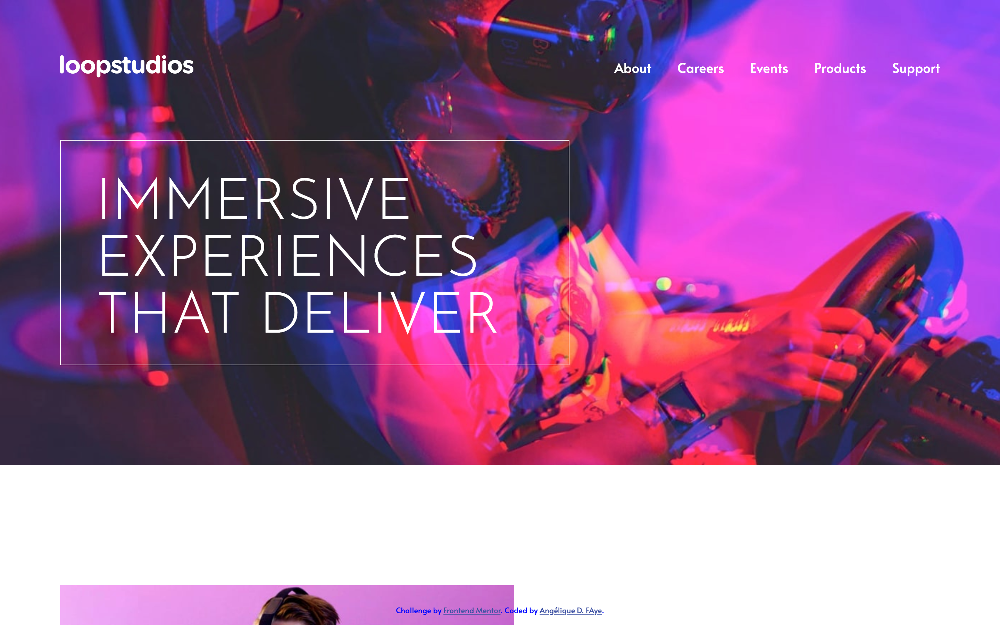
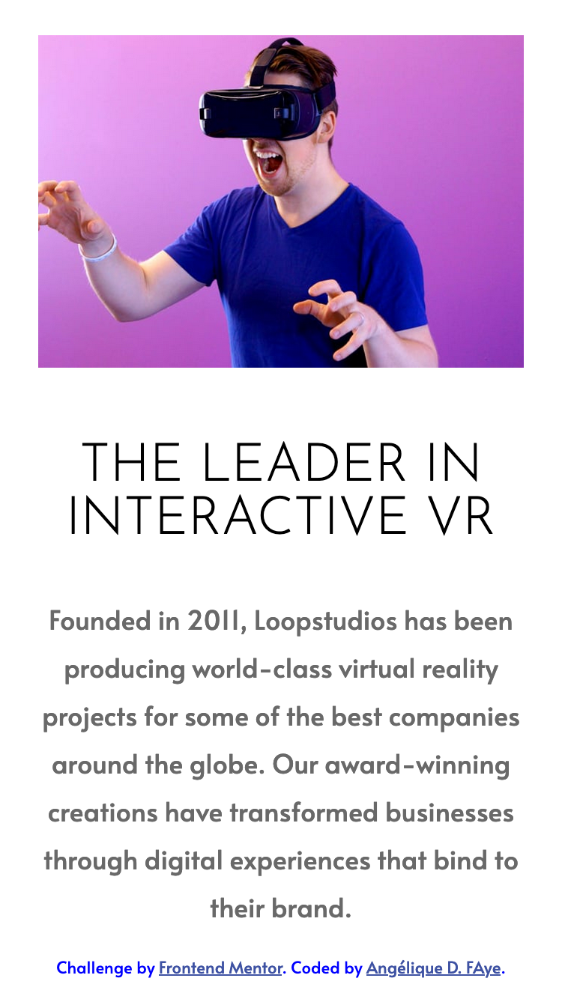
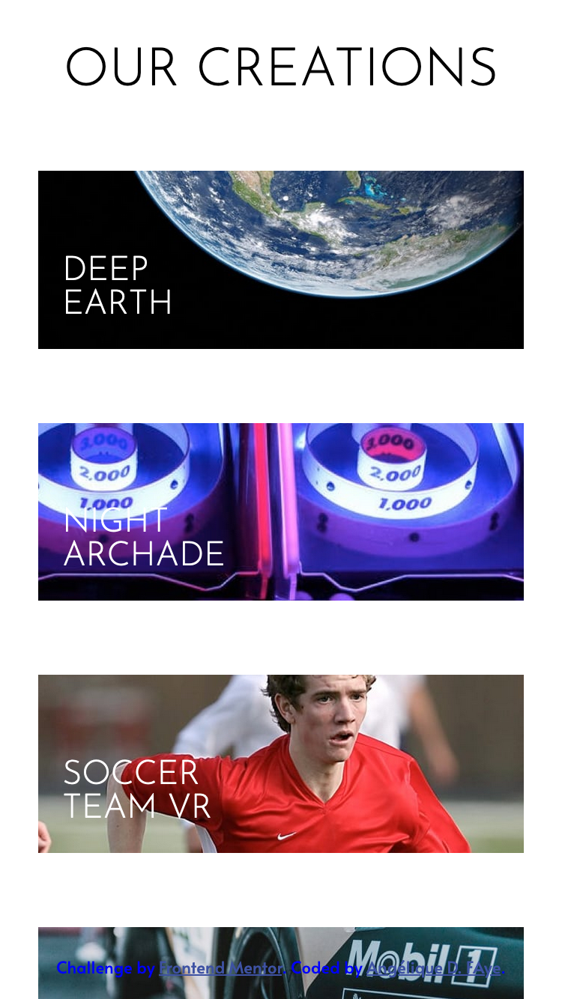

# Loopstudios landing page

  
  
  

## Overview

_The homepage for a VR experience service!_

 

## Links

<a href="https://github.com/AngeliqueDF/loopstudios-landing-page">GitHub repo</a> • <a href="https://loopstudios-landing-page-alpha-ten.vercel.app/">Live demo </a>

 

## How to run the project

1. `git clone https://github.com/AngeliqueDF/loopstudios-landing-page MY_FOLDER_NAME`
2. `cd MY_FOLDER_NAME`
3. `npm install`
4. `npm run dev`
5. visit `http://localhost:3000/`

 

   

## Features

- Responsive.
- Toggle mobile menu.

## Technologies

- HTML.
- CSS.
- JavaScript.

 

## Author

- [@AngeliqueDF on GitHub.](https://github.com/AngeliqueDF)
- [Visit my website.](https://adf.dev)
- [View my Frontend Mentor profile.](https://www.frontendmentor.io/profile/AngeliqueDF)
